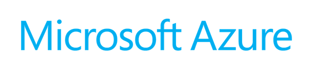
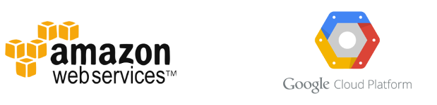
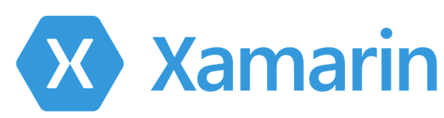

# Azure Mobile Apps QuickStart ハンズオン

『**Azure Mobile Apps クイックスタート**』を使って、簡単に TODOアプリを作ってみよう！   
実際に手を動かしてみましょう！   

という内容の資料を作っていきます。30分くらいの内容にしたいと思います。

# まずは基礎知識から

ハンズオンに入る前に、用語説明など、少しお勉強です。

## Microsoft Azure とは？

『**Microsoft Azure**』(アジュール) とは、マイクロソフトの提供する、クラウドサービスです。

Amazon 社の提供するクラウドサービスは『AWS』ですし、    
Google 社の提供するクラウドサービスは『GCP』と呼ばれていますね。

Microsoft 社の提供するクラウドサービスは『**Microsoft Azure**』と呼ばれています。  

(昔は『Windows Azure』という名前でしたが、Azure は『the public cloud platform』として、Windows など自社製品にとらわれることなく 様々な言語やOSを 幅広くカバーするということで、今の『**Microsoft Azure**』へと[改名された](https://blogs.msdn.microsoft.com/windowsazurej/2014/03/26/windows-azuremicrosoft-azure/)経緯があります。( 例えば Azure は [Linux のインスタンスも立ち上げられます](https://azure.microsoft.com/ja-jp/pricing/details/virtual-machines/linux/)し、[Oracle も動きます](https://azure.microsoft.com/ja-jp/campaigns/oracle/)))   

## Azure Mobile Apps とは？

Microsoft Azure は色々なサービスを提供していますが、    
**Mobile Apps** は、その中の「*モバイルアプリ用の機能(サービス)セット*」です。

Mobile Apps の提供する機能例：

1. <u>**データ保存**</u> (DBへの読み書き削除など)
1. <u>**ユーザ認証・ログイン機能**</u> (『Twitterでログイン』などの機能の提供)
1. <u>**プッシュ通知**</u> ("Remote Notification"とも呼ばれる。通知を飛ばす)
1. <u>**オフライン同期**</u> (オフライン時はローカルDBに保存しておき、オンラインになったらクラウド上のDBと同期させる、などの操作ができる機能)

他、もちろん、生成されたサーバサイドのコード(node.js または ASP.NET)を    
お手持ちのエディタや Azure上のオンラインエディタで    
ガリガリ自由にいじることもできます。

## Xamarin とは？

**Xamarin** (ざまりん) とは、   
Microsoft の提供する、**クロスプラットフォーム開発環境**です。    

C# (または F#)だけで、iOS/Android/Windows アプリ(など)を書くことができます。    
さらに、プラットフォーム間でのコード共有化をすることもできます。(ここが Xamarin 最大のメリットかな？)

# ハンズオン開始！

このハンズオンでは、

「*クライアントは Xamarin、サーバサイドは Azure Mobile Apps*」

を利用して進めます。

## リファレンス

### 公式ドキュメント：

* [Mobile Apps とは｜Microsoft Azure](https://docs.microsoft.com/ja-jp/azure/app-service-mobile/app-service-mobile-value-prop)
