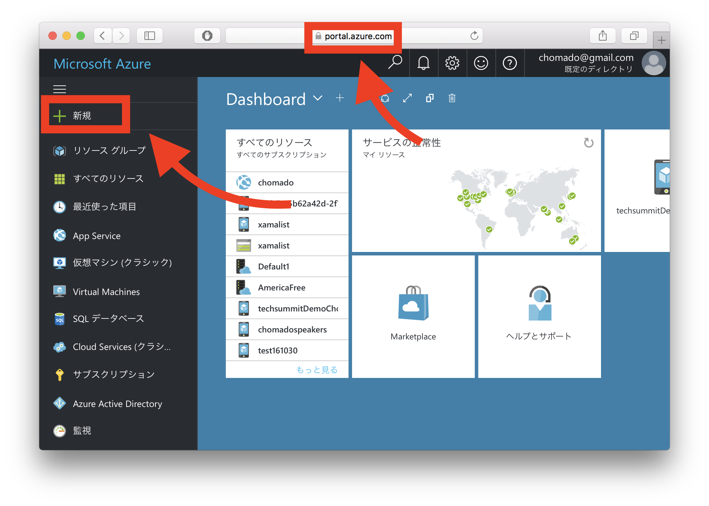
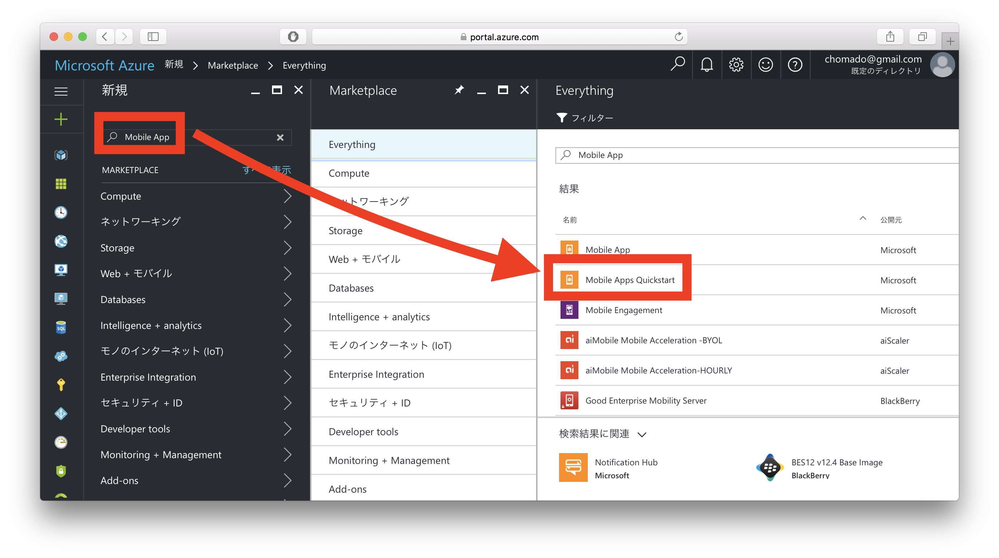
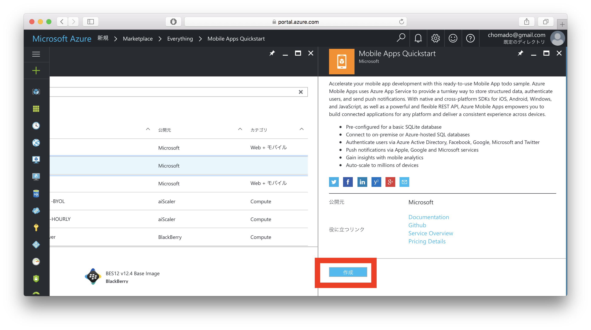
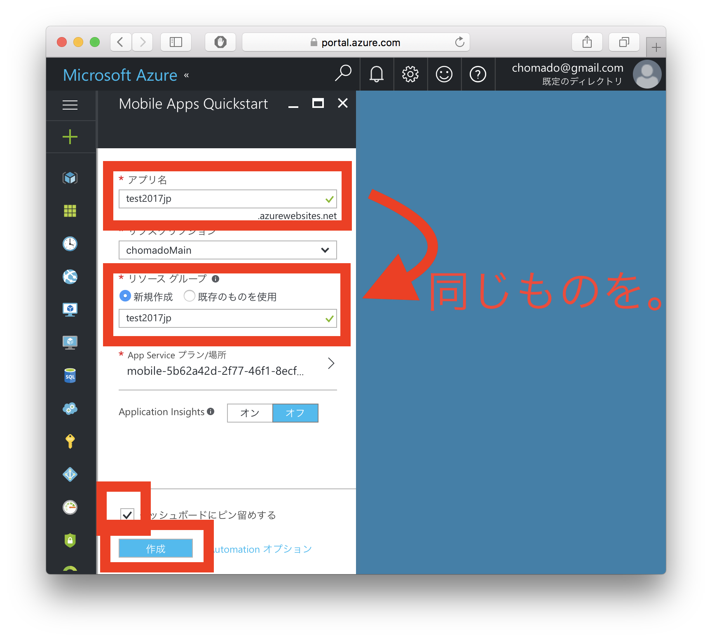
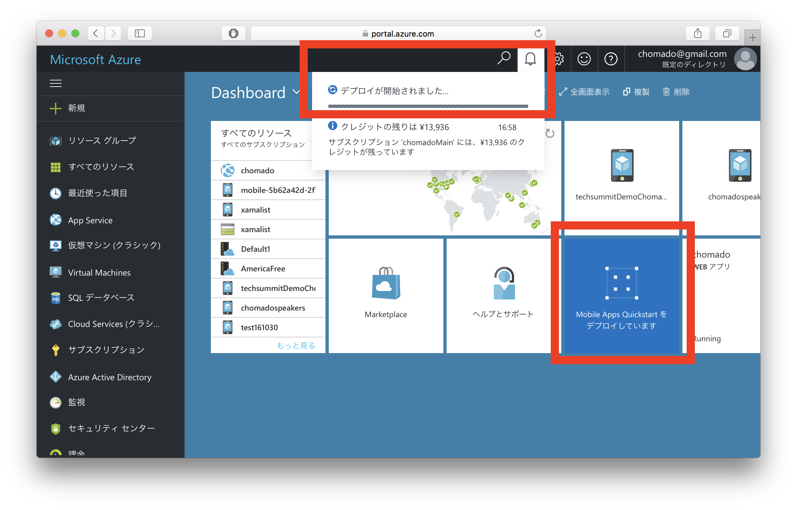
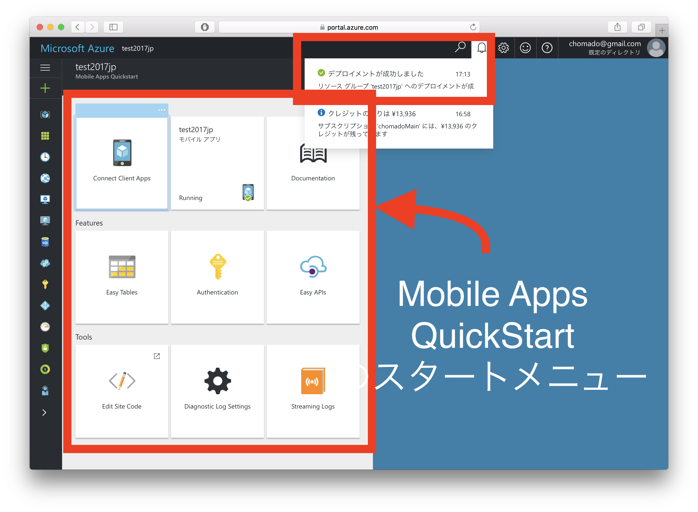
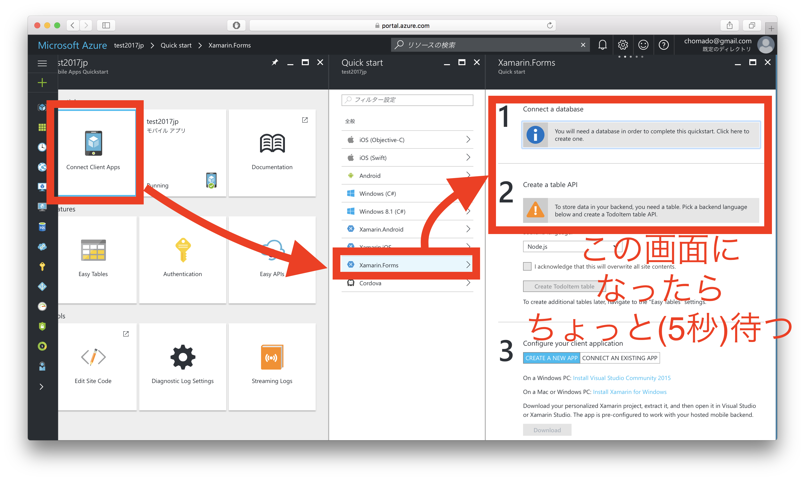
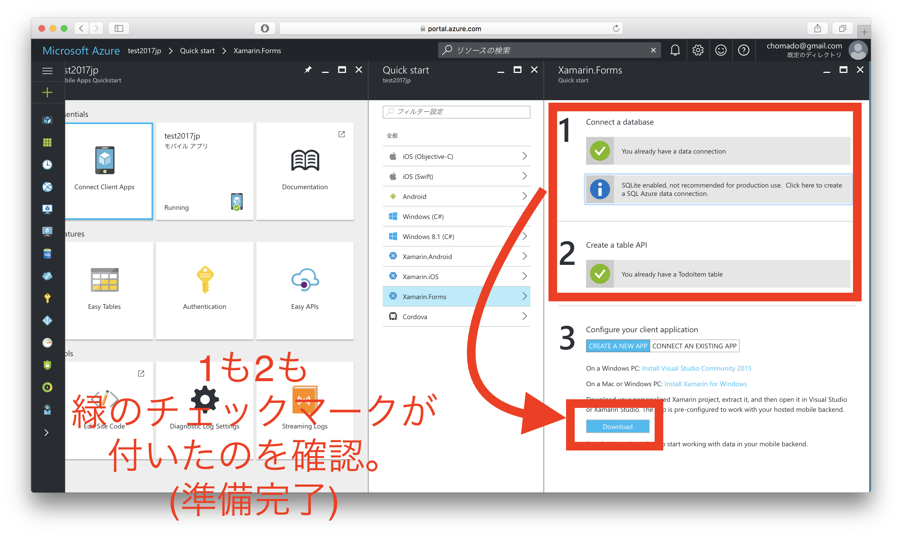

# ハンズオン開始！

このハンズオンでは、

「*クライアントは Xamarin、サーバサイドは Azure Mobile Apps*」

を利用して進めます。

## 0. Microsoft Azure の管理ポータルへ

まず、Microsoft Azure の管理ポータルを開きましょう。

Web ブラウザを開き、以下のページに。

[https://portal.azure.com/](https://portal.azure.com/)

## 1. Azure Mobile Apps のインスタンスをデプロイしよう

↑ 管理ポータルが開いたら、左上の「新規」ボタンをクリック。

↑ 検索バーに「`mobile app`」と入力し、
出てきた候補の「`Mobile Apps Quickstart`」をクリックする。        
（ここ間違いやすいから気をつけてください。「`Mobile App`」じゃないですよ、その下の「`Mobile Apps Quickstart`」です。(別にこっちでも良いのですがこのハンズオンではクイックスタートのほうで揃えます。)）

↑ 「作成」をクリックする

↑ アプリ名はどうする？など聞かれるので、入力する。

この時、他の既存のものとかぶるとエラーになるので、かぶらなさそうな名前で。

「リソースグループ」にも、上で定義した「アプリ名」と同じものを入れる。

そして「ダッシュボードにピン留め」にチェックをし、「作成」をクリックする。

↑ デプロイ中。しばらくかかる。3-5分くらい。

## 2. 作ったバックエンド(Azure Mobile Apps のインスタンス)に接続されたクライアントを入手しよう

待つと、デプロイが終わり、自動的にこの画面に移る。

↑ 9つメニュータイルが並んでいますね。今回はこの左上の「`Connect Client Apps`」を使います。

↑ 左上の「`Connect Client Apps`」をクリック。

そうすると対応するクライアントの種類が一覧で出るので、       
今回は「`Xamarin.Forms`」を選ぶ。

そうするとスクショ右のようなペインが出てくるので、5秒くらい待ってください。

↑ オールグリーンになり、下の「`ダウンロード`」ボタンが押せるようになるので、押してください。

そうすると .zip ファイルが落ちてくるので、適当なところに保存してください。
この .zip を解凍すると、バックエンドに接続済みのクライアントのプロジェクト(ソースコード)がまるまる入っています。
