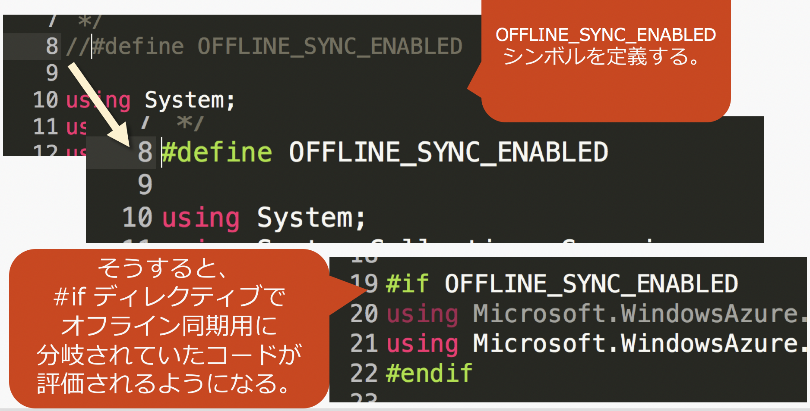
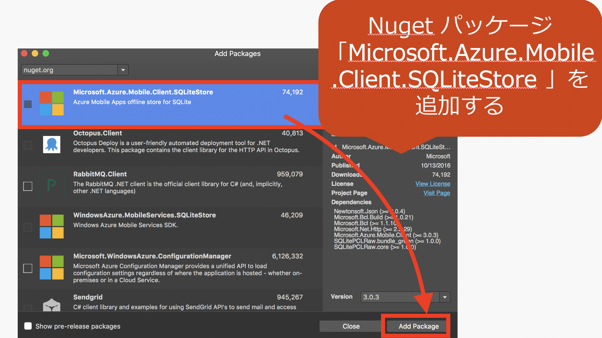

# オフライン同期を実装してみよう

現在のままでは、オフライン時ではアプリが落ちます。

なので、オフライン時でもアプリが動くようにしましょう。

↓仕組み

一度データをローカルDBに保存しておいて、オンライン時にクラウド上のDBと同期します。    
（自動的に同期処理が走るわけではなく、同期開始は好きなところにコードで指事する。例えば pull to refresh (引っ張る動作)のタイミングで、とか、アプリ起動時、とか、起動中 2秒ずつ確認、など。）

### 公式ドキュメント：

* [Azure モバイル アプリでのオフライン データ同期](https://docs.microsoft.com/ja-jp/azure/app-service-mobile/app-service-mobile-offline-data-sync)
* 手順書はこちら： [Xamarin.Forms モバイル アプリのオフライン同期の有効化](https://docs.microsoft.com/ja-jp/azure/app-service-mobile/app-service-mobile-xamarin-forms-get-started-offline-data)

## 手順

参考：
* [Xamarin.Forms モバイル アプリのオフライン同期の有効化](https://docs.microsoft.com/ja-jp/azure/app-service-mobile/app-service-mobile-xamarin-forms-get-started-offline-data)
* [Azure MobileApps + Xamarin.Forms開発の始め方（.NETバックエンド + Prism.Forms）「オフラインデータ同期」](http://blog.okazuki.jp/entry/2016/09/23/221959)

### 手順1

### 手順2

### 手順3 (iOS プロジェクトの場合)

### 手順4
エラーハンドリングのところを少し修正。

今回は、(ネットワークエラーで、クラウドDBとの)同期に失敗しても、     
変更を保持しておきたいので、取り合えず     
`TodoItemManager` クラス内の     
`error.CancelAndDiscardItemAsync()`     
をコメントアウトします 
