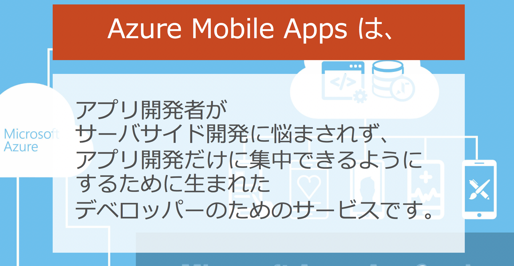
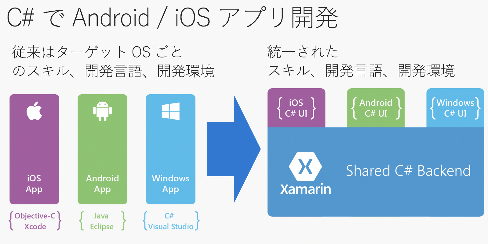
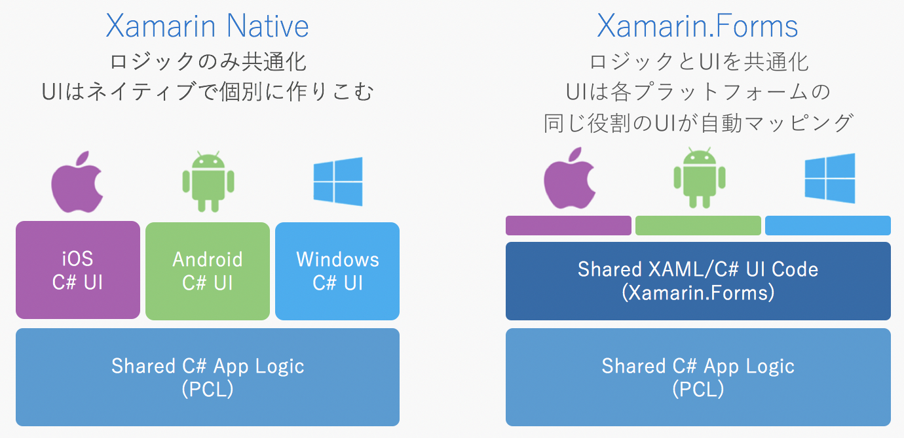

# まずは基礎知識から

ハンズオンに入る前に、用語説明など、少しお勉強です。

----

## Microsoft Azure とは？

『**Microsoft Azure**』(アジュール) とは、マイクロソフトの提供する、クラウドサービスです。

Amazon 社の提供するクラウドサービスは『AWS』ですし、    
Google 社の提供するクラウドサービスは『GCP』と呼ばれていますね。

Microsoft 社の提供するクラウドサービスは『**Microsoft Azure**』と呼ばれています。  

(昔は『Windows Azure』という名前でしたが、Azure は『the public cloud platform』として、Windows など自社製品にとらわれることなく 様々な言語やOSを 幅広くカバーするということで、今の『**Microsoft Azure**』へと[改名された](https://blogs.msdn.microsoft.com/windowsazurej/2014/03/26/windows-azuremicrosoft-azure/)経緯があります。( 例えば Azure は [Linux のインスタンスも立ち上げられます](https://azure.microsoft.com/ja-jp/pricing/details/virtual-machines/linux/)し、[Oracle も動きます](https://azure.microsoft.com/ja-jp/campaigns/oracle/)))   

----

## Azure Mobile Apps とは？

Microsoft Azure は色々なサービスを提供していますが、    
**Mobile Apps** は、その中の「*モバイルアプリ用の機能(サービス)セット*」です。

用語を使うと、**Mobile Apps** は「*Microsoft の提供する MBaaS*」とも言えます。     
（MBaaS: **Mobile Backend as a Service**）

Mobile Apps の提供する機能例：

1. <u>**データ保存**</u> (DBへの読み書き削除など)
1. <u>**ユーザ認証・ログイン機能**</u> (『Twitterでログイン』などの機能の提供)
1. <u>**プッシュ通知**</u> ("Remote Notification"とも呼ばれる。通知を飛ばす)
1. <u>**オフライン同期**</u> (オフライン時はローカルDBに保存しておき、オンラインになったらクラウド上のDBと同期させる、などの操作ができる機能)

他、もちろん、生成されたサーバサイドのコード(node.js または ASP.NET)を    
お手持ちのエディタや Azure上のオンラインエディタで    
ガリガリ自由にいじることもできます。

----

## Xamarin とは？

**Xamarin** (ざまりん) とは、   
Microsoft の提供する、**クロスプラットフォーム開発環境**です。     
（ひとつの開発環境で複数のプラットフォームのアプリを開発することを「クロスプラットフォーム開発」といいます。）

普通は iOSアプリは Swift/Obj-C、Androidアプリは Java で書きますが、

Xamarin を使えば、C# (または F#)だけで、iOS/Android/Windows アプリ(など)を書くことができます。    

さらに、プラットフォーム間でのコード共有化をすることもできます。(ここが Xamarin 最大のメリットかな？)

さらに、『**Xamarin.Forms**』を使うと、UI部分のコードも共通化できるので、さらなるコード共通化を図れます。    
今回のハンズオンは、この **Xamarin.Forms** を使うことになります。

----
## ここまでのまとめ

単語|読み方|意味|できること
----|----|----|----
**Microsoft Azure**|マイクロソフト・アジュール|Microsoft 社の提供するクラウドサービス。|色んなことができる ([参照](https://azure.microsoft.com/ja-jp/solutions/))
**Azure Mobile Apps**|アジュール・モバイル・アプス|Azure の中のモバイルアプリ開発のためのバックエンド機能セット(MBaaS)。DBにデータ保存したり通知やログイン機能などを提供する。|モバイルアプリのバックエンドをまるっと作ってくれる。だから開発者はフロントエンドの開発だけに集中できる
**Xamarin**|ザマリン|Microsoft 社の提供する、クロスプラットフォーム開発環境(ツール)|C#だけで iOS / Android / UWP アプリを、コード共通化しながら、効率良く開発することができる。ただし UI部分は それぞれのプラットフォームごとに書く必要がある
**Xamarin.Forms**|ザマリンフォームズ|Xamarin での開発手法のうちのひとつ。(Xamarin Native と Xamarin.Forms の 2択)。 Xamarin は 元々はコードを共有化できるのはロジック部分だけだったけど、 Xamarin.Forms を使えば UI 部分も共通化できる。|C#だけで iOS / Android / UWP アプリを、コード共通化しながら、超効率良く開発することができる。ロジック部分の他に、UI部分も共通化できる